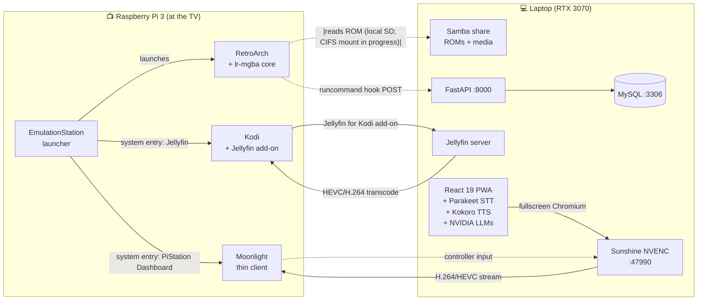

# PiStation

**A two-host retro gaming and media platform.**
Raspberry Pi 3 at the TV runs RetroPie for native emulation; a laptop on
the same network runs the analytics backend, media server, and an
AI-driven dashboard streamed back to the Pi over Sunshine + Moonlight.

> BSc Computer Science final-year artefact, University of Roehampton 2025–26.
> Submitted as **PiStation**; the GitHub repository is named `RetroWeb`
> for legacy reasons.

---

## What it actually is

The marker should be able to come away from this section saying:
*"Pi-and-laptop system, three interaction paths, original homebrew game
corpus, and a streamed dashboard with local AI."*

PiStation runs as **two physical hosts cooperating over the LAN** so each
can do what its hardware is suited for:

| Host | Hardware | Role |
|---|---|---|
| **Pi 3** | quad-core ARM, 1 GB RAM, no discrete GPU | TV-attached client. Native retro emulation, Kodi media playback, and Moonlight thin-client for the dashboard. |
| **Laptop** | x86_64, RTX 3070 Laptop 8 GB VRAM, 16 GB RAM | Analytics backend, MySQL, Jellyfin server, local STT/TTS, and the React dashboard streamed to the Pi via Sunshine NVENC. |

Three independent **interaction loops** run on top of these two hosts:



### Loop 1 — Native gaming (Pi-side)

EmulationStation lists every system on the Pi (GBA, SNES, NES, etc.).
The user picks a game; RetroArch launches it natively on the Pi using
the appropriate libretro core (`lr-mgba` for the three GBA homebrew
titles in this submission). ROMs themselves live on the laptop's Samba
share, mounted on the Pi via CIFS, so storage is centralised but
emulation runs on the device best suited to low-latency input.

RetroPie's `runcommand-onstart.sh` and `runcommand-onend.sh` hooks fire
before and after each game session and POST/PATCH session metadata
(ROM path, system, emulator, core, hostname, started/ended timestamps,
duration) to the FastAPI backend on the laptop. That's how a session
played on the Pi shows up in the dashboard.

### Loop 2 — Media (split across both hosts)

**Jellyfin** is registered as an EmulationStation system entry, so it
appears in the carousel alongside SNES and GBA. Selecting it runs a
launcher script that opens an X session on a separate VT and starts
**Kodi** with the **Jellyfin for Kodi** add-on (or, if Kodi isn't
installed, falls back to a Chromium kiosk pointing at Jellyfin's web
UI). Either way, library scanning and any transcoding happen on the
laptop's GPU; the Pi's only job is HEVC / H.264 playback decode.

### Loop 3 — Dashboard + AI (laptop, streamed to Pi)

The React 19 + Vite 7 + Tailwind v4 PWA runs in a fullscreen Chromium
window on the laptop, backed by FastAPI on `:8000`, MySQL on `:3306`,
**Parakeet TDT 1.1B** on `:8786` (local STT, fp16 on CUDA), and
**Kokoro ONNX** on `:8787` (local TTS). LLM completions go through
NVIDIA's `integrate.api.nvidia.com` with a 7-model picker (Step 3.5 Flash,
DeepSeek V4 Pro, Kimi K2 Thinking, Mistral Large 3, Gemma 3 27B,
GLM 4.7, MiniMax M2.7).

The laptop's display is captured by **Sunshine NVENC** and sent to the
Pi as an H.264/HEVC video stream; the Pi runs **Moonlight** to decode
and display it on the TV, with controller and keyboard input forwarded
back over the same connection. The Pi 3 cannot render a modern React
PWA, but it can decode hardware video, so the dashboard "appears" on
the Pi without the Pi doing the heavy work.

---

## Why the architecture looks like this

Pi 3 is strong at low-latency native emulation, weak at GPU-bound work
(modern web stacks, AI inference, video transcoding). The laptop is
strong at GPU work, weak at being attached to a TV. Two-host with
Sunshine/Moonlight as the bridge gets the best of both: the user sees
a unified single-device experience at the TV while the laptop's GPU
transparently does the heavy lifting.

This is consistent with the literature reviewed in the report
(Rzepka, Gamess, Suder) which warns against forcing modern frontend
workloads onto Pi-class hardware. Sunshine + Moonlight are tools
designed for exactly this thin-client/thick-server split.

---

## The three original homebrew games

To avoid commercial-ROM copyright issues with the test corpus, three
GBA homebrew titles were written specifically for this project. All
three follow the same pipeline: rapid Python prototype on the laptop
to iterate gameplay, then a port to GBA-native C or C++ that runs on
the Pi via `lr-mgba`.

| Game | Lang (GBA build) | Origin | Asset sourcing | README |
|---|---|---|---|---|
| **Red Racer** | C | Python prototype → C port | Mixed; prototype reference assets withheld; GBA build assets attributed | [games/Red Racer/](games/Red%20Racer/README.md) |
| **Mythical** | C++ | Python prototype → C++ port | All project-author original | [games/Mythical/](games/Mythical/README.md) |
| **Bastion Tower Defence** | C++ (Butano) | Python+SDL2 prototype → Butano port | Mix of project-original and licensed open-source | [games/BastionTD/](games/BastionTD/README.md) |

The Python-to-GBA-native pipeline is itself a CS deliverable: fixed-point
math, 240×160 framebuffer constraints, no dynamic allocation in hot
paths, sprite tile/palette layout, ROM mapping. See
[`games/README.md`](games/README.md) for the cross-game write-up.

---

## Repository layout

```
PiStation/
├── README.md                  ← you are here (system overview)
├── DEVLOG.md                  Month-by-month development log (Oct 2025 → Apr 2026)
├── laptop/
│   └── README.md              Laptop component: dashboard, FastAPI, voice, services
├── pi/
│   ├── README.md              Pi component: RetroPie, Kodi, Moonlight, hooks, mount
│   └── scripts/               Pi-side scripts (runcommand hooks, fstab, es_systems.cfg)
├── games/
│   ├── README.md              Cross-game overview + Python→GBA pattern
│   ├── Red Racer/             Original GBA homebrew (C, Python prototype origin)
│   ├── Mythical/              Original GBA homebrew (C++, Python prototype origin)
│   └── BastionTD/             Original GBA homebrew (Butano C++, SDL2 prototype origin)
│
├── backend/                   Laptop component — FastAPI implementation
│   ├── app/                   routes, services, repositories, models
│   ├── migrations/            SQL + seeds
│   └── requirements.txt
├── src/                       Laptop component — React 19 PWA implementation
│   ├── routes/, components/, lib/, gamepad/, data/, stores/
│   └── ARCHITECTURE.md, AI_ASSISTANT.md
├── scripts/
│   ├── parakeet-server.py     Local STT REST wrapper (:8786)
│   ├── kokoro-tts-server.py   Local TTS REST wrapper (:8787)
│   └── dashboard-stream.sh    Xvfb + FFmpeg fallback streamer
├── public/                    Static assets, audio worklets, model icons
├── start.mjs                  Service orchestrator (XAMPP → FastAPI → STT → TTS → Vite → Sunshine)
└── tests/                     Frontend test runner
```

The `backend/`, `src/`, `scripts/`, and `public/` directories are the
**laptop component's implementation** — `laptop/README.md` is the
human-facing entry point for that component. Pi-side artefacts live
under `pi/`.

---

## End-to-end: how a single session flows

A concrete walkthrough of all three loops touching one piece of state.

1. User on the sofa picks **Bastion Tower Defence** in EmulationStation
   on the Pi.
2. ES invokes RetroArch with the lr-mgba core; runcommand-onstart fires
   and shells out to `~/pistation/session_logger.py`, which POSTs to
   `http://<laptop-host>:8000/session/start` with
   `{pi_hostname, rom_path, system_name="gba", emulator="retroarch",
   core="mgba", started_at}`. FastAPI writes a row to `sessions` in
   MySQL and returns the new `session_id`; the logger stashes it in
   `/tmp/pistation_session.json`.
3. RetroArch reads the ROM (currently from the Pi's local SD at
   `/home/pi/RetroPie/roms/gba/BastionTD.gba`; the CIFS-mounted
   `/mnt/laptop/games/gba/...` setup is documented in
   [pi/scripts/setup-cifs-mount-pi.sh](pi/scripts/setup-cifs-mount-pi.sh))
   and runs it natively on the Pi.
4. User plays for 12 minutes; presses select+start to exit.
5. runcommand-onend fires; `session_logger.py` reads the state file
   and POSTs `http://<laptop-host>:8000/session/end` with
   `{session_id, ended_at, duration_seconds=720}`.
6. User opens the **Dashboard** entry in EmulationStation. ES launches
   Moonlight, which connects to Sunshine on the laptop. The laptop's
   fullscreen Chromium window (already serving the React dashboard from
   Vite on `:5173`) appears on the TV.
7. The "Recently played" tile on the dashboard now shows BastionTD with
   the just-completed 12-minute session — read from the same MySQL row
   the runcommand hook wrote.
8. User pushes-to-talk, says *"How long did I play Bastion this week?"*
   Parakeet transcribes locally; the AI context service queries the
   `sessions` table; NVIDIA's LLM produces an answer streamed back to
   Kokoro for TTS. The user hears the reply on the TV speakers.

That flow is the artefact. Each component README documents the
implementation behind its part of the path.

---

## Quick start

The laptop side has the heavier setup. See **[laptop/README.md](laptop/README.md)** for full
prerequisites (Node 22, Python 3.12, CUDA GPU ≥ 8 GB VRAM, MySQL 8,
NVIDIA API key) and `npm start` to bring the whole laptop stack up.

The Pi side has its own setup steps documented in
**[pi/README.md](pi/README.md)** — RetroPie image, controller pairing,
Samba/CIFS mount, Kodi system entry, Moonlight pairing.

To run the Bastion build pipeline (the most involved of the three
games), see **[games/BastionTD/setup.md](games/BastionTD/setup.md)**.
The other two games' build prerequisites are documented in their
own READMEs.

---

## Submission context

This is a 35%-weighted artefact submission for the BSc CS final-year
project at the University of Roehampton, academic year 2025–26.
The repository name `RetroWeb` predates the rename to PiStation and
is preserved on GitHub for assessment continuity; all in-repo
documentation refers to the project as PiStation.

The accompanying report (separate document) covers the literature
review, design decisions, methodology, evaluation, and reflection.
This repository is the artefact that the report describes.

---

## Status

| Loop | Status |
|---|---|
| Loop 1 — RetroPie native gaming with runcommand→FastAPI session capture | Operational |
| Loop 2 — Kodi with Jellyfin-for-Kodi against laptop-hosted Jellyfin server | Operational |
| Loop 3 — Sunshine→Moonlight dashboard delivery + voice cascade | Operational |
| Original GBA homebrew corpus (Red Racer, Mythical, BastionTD) | Built and runnable on Pi |

Known limitations and the full evaluation are in the report.
