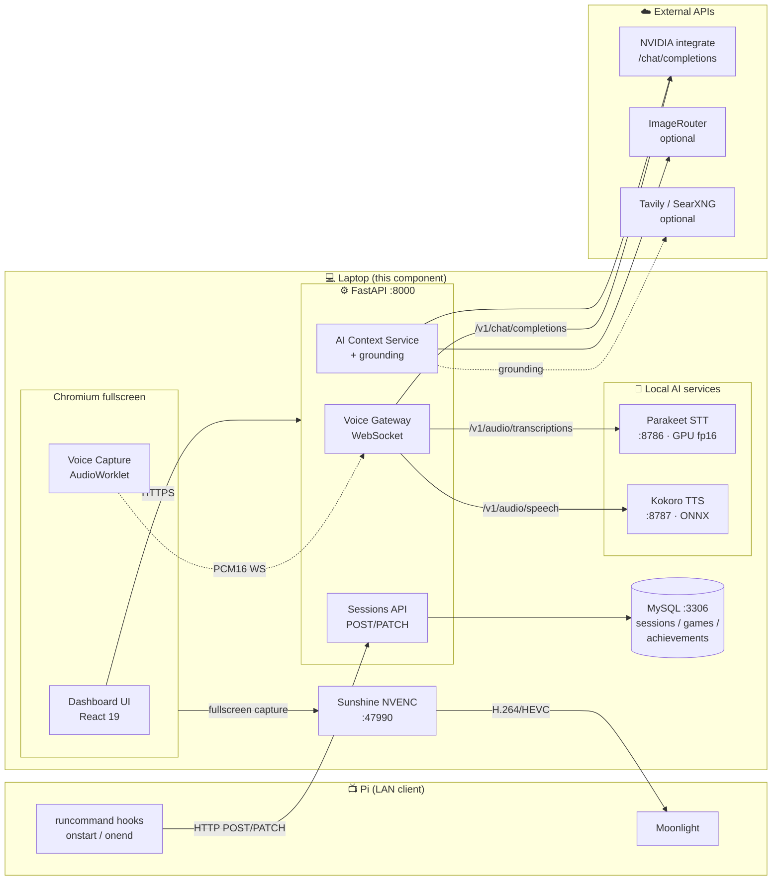
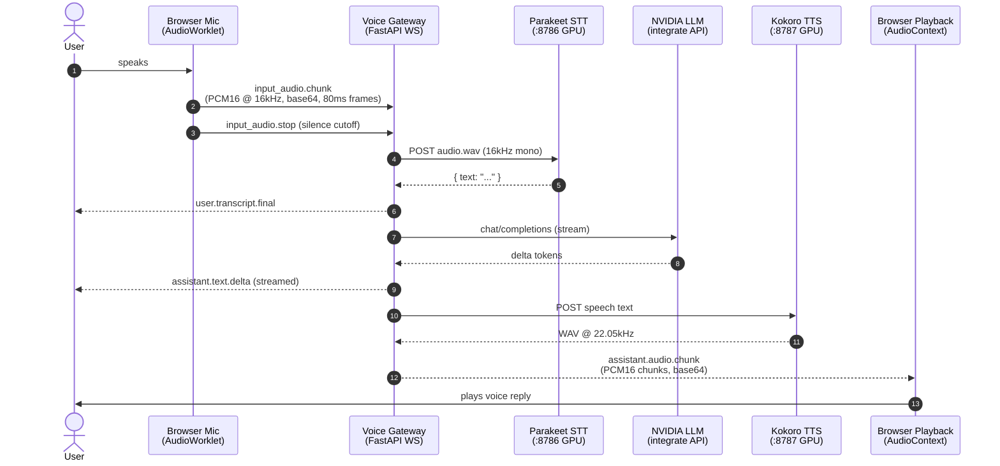

# PiStation — Laptop Component

> **Context.** This README covers the **laptop side** of PiStation. The
> system as a whole is a two-host architecture (Pi 3 at the TV, laptop
> elsewhere on the LAN); see the [top-level README](../README.md) for
> the system overview and the [Pi component](../pi/README.md) for the
> Pi-side documentation.

The laptop runs five things that the Pi cannot run well or cannot run
at all:

1. **FastAPI backend** + **MySQL** — receives runcommand session POSTs from the Pi, persists analytics, serves the dashboard.
2. **React 19 + Vite 7 dashboard** — gameplay analytics, multi-model AI chat, voice assistant. Renders fullscreen in Chromium on the laptop.
3. **Local AI stack** — Parakeet TDT 1.1B (STT, fp16 on CUDA) and Kokoro ONNX (TTS), so the assistant works without sending audio to third-party services.
4. **Sunshine NVENC** — captures the laptop's display (the dashboard) and streams it as H.264/HEVC to the Pi's Moonlight client. This is how the dashboard *appears* on the TV without the Pi having to render it.
5. **Jellyfin server** *(separate process; not orchestrated by `start.mjs`)* — hosts the media library that Kodi on the Pi connects to via the Jellyfin-for-Kodi add-on.

The dashboard also includes a **browser-WASM emulation route** built on
Nostalgist + libretro WASM cores. This was an early-stage prototype of
the emulation path; the project's production emulation runs natively on
the Pi via RetroArch (see [pi/README.md](../pi/README.md)). The WASM
route remains in the codebase as an offline-capable fallback and is
documented under "Library page" status below.

---

## Table of Contents

- [Feature Matrix](#feature-matrix)
- [Backend Architecture](#backend-architecture)
- [Voice Pipeline](#voice-pipeline)
- [Quick Start](#quick-start)
- [Configuration](#configuration)
- [Service Map](#service-map)
- [Project Layout](#project-layout)
- [Scripts Reference](#scripts-reference)
- [Voice Activation Modes](#voice-activation-modes)
- [Model Picker](#model-picker)
- [Troubleshooting](#troubleshooting)
- [Hardware Requirements](#hardware-requirements)
- [Tech Stack](#tech-stack)

---

## Feature Matrix

| Area | Status | Notes |
|---|---|---|
| Dashboard analytics | Operational | Total playtime, top games, system share, recent sessions — fed by runcommand POSTs from the Pi |
| Sessions tracking | Operational | Live "now playing" + historical search/filter |
| Achievements | Operational | 14 seeded achievements, unlock progress + category grouping |
| Controller diagnostics | Operational | Live gamepad visualisation + keyboard rebinding |
| AI chat (text) | Operational | Multi-model via NVIDIA integrate API |
| AI chat (voice) | Operational | Parakeet STT → NVIDIA LLM → Kokoro TTS |
| Voice activation modes | Operational | Auto near-field · Headset · Push-to-talk (`T` key) |
| Web-grounded answers | Operational | Optional Tavily / SearXNG backend |
| Kiosk mode | Operational | TV/cabinet-ready fullscreen, `?lite=1` minimal variant |
| Sunshine streaming target | Operational | NVENC → Moonlight client on Pi |
| Image generation | Operational | ImageRouter API (optional) |
| Browser-WASM emulation route | Prototype | Secondary path; production emulation is on the Pi |

---

## Backend Architecture



The dashboard window is captured by Sunshine and forwarded to Moonlight
on the Pi; controller and keyboard input flow back over the same
connection. The arrow direction matters — the laptop is the *source*
of the stream, the Pi is the *sink*.

---

## Voice Pipeline

End-to-end flow for a single spoken turn:



**Key invariants:**

- Audio leaving the browser is always **PCM16 @ 16 kHz mono** (downsampled client-side in `voice-capture-processor.js`).
- Audio returning to the browser is always **PCM16 @ 22.05 kHz mono**, rechunked at 80 ms boundaries for smooth playback.
- VAD auto-suppresses while TTS is playing, so the assistant cannot transcribe its own voice in `auto_near_field` mode.

<details>
<summary><b>Click for deeper voice internals</b></summary>

- **Providers:** `voice_provider_order` in `.env` accepts `hosted,voicechat,legacy`. `legacy` is the current local Parakeet+Kokoro cascade; `voicechat` is the NVIDIA Nemotron realtime preview (disabled by default).
- **Graceful fallback:** if the primary provider's `health()` fails at session-start time, the gateway falls back to the next in order and emits a `provider.changed` event.
- **Session timeout:** `VOICE_SESSION_MAX_SECONDS` (default 840s / 14 min). A `session.expiring` event fires 5–30 s before to let the client reconnect cleanly.
- **Turn cancellation:** the frontend can send `response.cancel`; the gateway sets a `cancel_event` that interrupts both LLM streaming and TTS chunk delivery.
- **Text-chat TTS:** typed messages also get voiced when voice is enabled. `createTTSSession()` in `useChatVoice.ts` returns a dedicated `AudioContext`-backed session that flushes at sentence/clause boundaries so playback starts while the LLM is still generating.

</details>

---

## Quick Start

### Prerequisites

| Requirement | Version | Why |
|---|---|---|
| Node.js | 20.19+ or 22.12+ | Vite 7 |
| Python | 3.12+ | FastAPI + NeMo |
| CUDA GPU | RTX 20-series or newer, 8 GB+ VRAM | Parakeet 1.1B fp16 + Kokoro ONNX |
| MySQL | 8.x (XAMPP OK) | Stats/sessions persistence |
| NVIDIA API key | [build.nvidia.com](https://build.nvidia.com) | LLM inference |
| Sunshine | latest | Stream the dashboard to the Pi via Moonlight |
| Samba server | system package | Share ROMs and media to the Pi via CIFS |

### Install

```bash
git clone https://github.com/AlviHossain97/RetroWeb.git PiStation
cd PiStation
npm install
python3 -m pip install -r backend/requirements.txt
cp backend/.env.example backend/.env
# Edit backend/.env — set NVIDIA_API_KEY and DB_PASSWORD at minimum.
```

### Run the laptop stack

```bash
npm start
```

Equivalent to `node start.mjs`, which boots **XAMPP → FastAPI → Kokoro → Parakeet → Vite → Sunshine** in that order. The dashboard lands on `http://localhost:5173` (or whatever Vite picks). For the full dashboard-on-TV experience, pair Moonlight on the Pi against this laptop's Sunshine first; see [pi/README.md](../pi/README.md).

### Run the frontend alone

If you don't need the AI stack (offline dev on UI-only changes):

```bash
npm run dev
```

### Run tests

```bash
npm test
python3 -m unittest discover -s backend/tests
```

---

## Configuration

All backend config lives in [`../backend/.env`](../backend/.env.example) (gitignored) and is loaded via pydantic-settings. **Shell env vars take precedence over `.env`** — set `NVIDIA_API_KEY` globally if you want it inherited by any process without editing the file.

<details>
<summary><b>Full environment variable reference</b></summary>

### Required

| Variable | Example | Purpose |
|---|---|---|
| `NVIDIA_API_KEY` | `nvapi-...` | LLM chat completions |
| `DB_PASSWORD` | `changeme` | MySQL user password |

### Voice cascade

| Variable | Default | Purpose |
|---|---|---|
| `VOICE_PROVIDER_ORDER` | `legacy` | Ordered list: `legacy`, `voicechat`, `hosted` |
| `VOICE_LOCAL_STT_URL` | `http://localhost:8786` | Parakeet server endpoint |
| `VOICE_LOCAL_TTS_URL` | `http://localhost:8787` | Kokoro server endpoint |
| `VOICE_SESSION_MAX_SECONDS` | `840` | Session lifetime before forced reconnect |
| `NVIDIA_MODEL` | `stepfun-ai/step-3.5-flash` | LLM used by voice cascade |

### Optional — NVIDIA Nemotron realtime voicechat

| Variable | Default | Purpose |
|---|---|---|
| `NVIDIA_VOICECHAT_ENABLED` | `false` | Enable the single-provider realtime fallback |
| `NVIDIA_VOICECHAT_MODEL` | `nemotron-voicechat` | Model name |
| `NVIDIA_VOICECHAT_UPSTREAM_URL` | — | WebSocket URL |

### Optional — web grounding

| Variable | Default | Purpose |
|---|---|---|
| `WEB_SEARCH_MODE` | `auto` | `auto` / `always` / `never` |
| `SEARXNG_URL` | — | Self-hosted search endpoint |
| `TAVILY_API_KEY` | — | Managed search fallback |
| `SEARCH_TOP_K` | `5` | Results per query |

### Optional — image generation

| Variable | Default | Purpose |
|---|---|---|
| `IMAGEROUTER_API_KEY` | — | Enables `/ai/generate-image` |
| `IMAGEROUTER_IMAGE_MODEL` | `google/nano-banana-2:free` | Default image model |

### Parakeet runtime tunables (server env, not in `.env`)

| Variable | Default | Purpose |
|---|---|---|
| `PARAKEET_MODEL` | `nvidia/parakeet-tdt-1.1b` | Swap to `parakeet-tdt-0.6b-v2` for pure-English or lower VRAM |
| `PARAKEET_DEVICE` | `cuda` | Set `cpu` for CPU-only (very slow) |
| `PARAKEET_HALF` | `1` | Set `0` to force fp32 |

</details>

---

## Service Map

| Service | Port | Started by | Kills gracefully via |
|---|---|---|---|
| Vite dev server | 5173 | `start.mjs` | Ctrl+C |
| FastAPI backend | 8000 | `start.mjs` → `uvicorn` | SIGTERM |
| Parakeet STT | 8786 | `start.mjs` → `scripts/parakeet-server.py` | SIGTERM |
| Kokoro TTS | 8787 | `start.mjs` → `scripts/kokoro-tts-server.py` | SIGTERM |
| MySQL (XAMPP) | 3306 | `/opt/lampp/lampp start` | `/opt/lampp/lampp stop` |
| Sunshine | 47990 | `start.mjs` | systray → Quit |
| phpMyAdmin | 80 | XAMPP Apache | XAMPP |
| Jellyfin server | 8096 | system service (separate; not in `start.mjs`) | systemd |

---

## Project Layout

The laptop component's source lives at the repository root (it predates
the `laptop/` directory; the source files were not relocated to avoid
breaking deploy tooling and import paths). Pi-side artefacts are under
`../pi/`; original game source is under `../games/`.

```
laptop/                            (this README is the only file in here)

../backend/                        FastAPI + pydantic-settings
├── app/
│   ├── routes/                    12 route modules (voice, ai, stats, sessions, …)
│   ├── services/                  voice_gateway, ai_context, grounding, tools, …
│   ├── repositories/              MySQL query layer
│   ├── models/                    Pydantic DTOs
│   └── config.py                  Settings (pydantic-settings)
├── migrations/                    SQL + seed
├── tests/                         unittest (voice gateway, Speechmatics client)
└── requirements.txt

../scripts/
├── parakeet-server.py             NeMo ASR REST wrapper (:8786)
├── kokoro-tts-server.py           Kokoro-ONNX REST wrapper (:8787)
├── kokoro-models/                 354 MB ONNX weights + voices (gitignored)
├── audit-cores.ts / download-cores.ts
└── dashboard-stream.sh            Xvfb + FFmpeg UDP fallback streamer

../src/                            React app
├── routes/                        Lazy-loaded page components
├── components/                    UI + shadcn primitives
├── lib/                           Business logic (emulation, storage, i18n, …)
├── gamepad/                       Input mapping
├── data/                          Static config (coreMap, system metadata)
├── stores/                        Zustand stores
├── ARCHITECTURE.md                Frontend architecture notes
└── AI_ASSISTANT.md                Voice assistant internals

../public/
├── cores/                         RetroArch WASM cores (browser fallback only)
├── audio-worklets/                voice-capture-processor.js
├── model-icons/                   Model picker thumbnails
└── fonts/

../tests/                          Node test runner (.test.mjs)
../start.mjs                       Service orchestrator
../vite.config.ts                  Proxies: /api/nvidia, /api/pistation (ws:true), /api/kokoro, /api/whisper
../package.json
```

---

## Scripts Reference

| Script | What it does |
|---|---|
| `npm start` | Bring up the whole laptop stack (XAMPP, FastAPI, Kokoro, Parakeet, Vite, Sunshine) |
| `npm run dev` | Vite only — useful for UI-only iterations |
| `npm run build` | `tsc -b && vite build` — typechecks and produces `dist/` |
| `npm run preview` | Serve the production build locally |
| `npm run lint` | ESLint over the repo |
| `npm test` | Run frontend tests (`tests/*.test.mjs`) |
| `PI_IP=192.168.1.100 npm start` | Additionally stream the desktop to a Pi via UDP (Xvfb + FFmpeg fallback path; Sunshine + Moonlight is preferred) |

---

## Voice Activation Modes

Configurable in the chat → voice settings overlay. The mode persists per session.

| Mode | Trigger | Best for |
|---|---|---|
| `auto_near_field` | Continuous listening with VAD (energy + silence cutoff ≈ 1300 ms) | Desktop mic at 0.5–2 m |
| `headset` | Same VAD but tighter thresholds (noise: 0.010, silence: 900 ms) | Wearing a headset |
| `push_to_talk` | Hold `T` key or long-press mic button | Noisy rooms, shared spaces |

In all continuous modes, the frontend suppresses VAD activation while
TTS audio is actively playing so the assistant cannot transcribe its
own voice.

---

## Model Picker

Currently exposed LLMs (editable in [`../src/routes/chat/constants.ts`](../src/routes/chat/constants.ts)):

- Gemma 3 27B
- Kimi K2 Thinking
- Mistral Large 3 675B
- Step 3.5 Flash
- **DeepSeek V4 Pro** *(default for reasoning-heavy replies)*
- **MiniMax M2.7**
- GLM 4.7

All go through NVIDIA's `integrate.api.nvidia.com/v1/chat/completions` with streaming enabled. To add another, append to `NVIDIA_MODELS` and drop an icon at `public/model-icons/{modelname}.png`.

---

## Troubleshooting

<details>
<summary><b>🎙️ Mic shows 0 input devices in browser</b></summary>

Usually one of:

1. **PipeWire user service is down.** Verify: `systemctl --user is-active pipewire pipewire-pulse wireplumber`. Fix: `systemctl --user start pipewire.socket pipewire pipewire-pulse wireplumber`.
2. **No default source configured.** Check `wpctl status` — the `Sources:` block should have an entry with `*` marker. If not: `wpctl set-default <node-id>`.
3. **Browser process cached an empty device list.** After fixing 1 or 2, fully quit the browser (not just close the tab) and reopen.
4. **Brave fingerprinting Shield blocking.** Click the lion icon in URL bar → "Block fingerprinting" → "Allow all fingerprinting", then reload.

</details>

<details>
<summary><b>🧠 Parakeet OOMs on load (8 GB GPU)</b></summary>

The loader is already fp16 + CPU-first, but if you still OOM:

1. Close Brave before launching the stack — its GPU process reserves ~300–500 MB of VRAM.
2. Temporarily stop Sunshine if you're not streaming: `pkill -x sunshine`.
3. Fall back to the 0.6b model: `PARAKEET_MODEL=nvidia/parakeet-tdt-0.6b-v2 npm start`.

</details>

<details>
<summary><b>🔊 Dashboard is laggy (locally, before Sunshine)</b></summary>

Common causes in order of likelihood:

1. **Browser running with GL disabled after a driver change.** Check `ps -ef | grep gpu-process` — if you see `--use-gl=disabled` or `--disable-gpu-compositing`, fully quit and restart the browser.
2. **`packagekitd` doing an update check.** It will settle in ~60 s. `systemctl stop packagekit` if urgent.
3. **Parakeet + Kokoro + Sunshine + browser all competing for the GPU.** Check `nvidia-smi`; if VRAM > 95 % used, stop Sunshine.

</details>

<details>
<summary><b>📺 Moonlight on the Pi shows lag, dropped frames, or stutter</b></summary>

This is the streamed-dashboard path, not the local one.

1. **Wi-Fi between Pi and laptop is too slow.** Sunshine wants ≥ 25 Mbit/s sustained. Test with `iperf3` Pi → laptop. Wired Ethernet on both ends is the default fix.
2. **Encoder set wrong in Sunshine.** Open `https://localhost:47990` (Sunshine web UI) → Configuration → Video → Encoder. Force NVENC. Software x264 will starve the CPU.
3. **Pi 3's HDMI is being underclocked.** Set `hdmi_drive=2` and `hdmi_pixel_freq_limit=400000000` in the Pi's `/boot/config.txt`.
4. **Bitrate too high for the link.** Drop bitrate in Moonlight settings on the Pi (start at 10 Mbit/s 1080p30, raise from there).

</details>

<details>
<summary><b>⚙️ FastAPI won't start with VOICE_PROVIDER_ORDER error</b></summary>

pydantic-settings tries to JSON-decode list-typed env vars by default. The fix is already applied (`NoDecode` annotation in `config.py`). If you still hit this, make sure your `VOICE_PROVIDER_ORDER` is a plain comma-separated string like `legacy` or `legacy,voicechat`, **not** a JSON array.

</details>

<details>
<summary><b>🌐 Text chat works but voice chat returns "Could not transcribe"</b></summary>

Open `/tmp/pistation.log` and look for `[VOICE] input_audio.stop chunks_sent=N bytes=NNNNN (~X.XXs)`.

- `chunks_sent=0` → frontend isn't streaming audio. Check mic permission + that `/api/pistation` Vite proxy has `ws: true`.
- `bytes` tiny but chunks > 0 → audio is silent. Check OS mic level in GNOME Settings.
- Transcription path runs but returns empty text → audio was silent or Parakeet rejected it. Try a longer, louder phrase.

</details>

<details>
<summary><b>🎮 Pi sessions aren't appearing in the dashboard</b></summary>

The runcommand hooks on the Pi are responsible for posting session
metadata; the laptop only ingests. To diagnose from the laptop side:

1. Tail the FastAPI log: `journalctl --user -u fastapi -f` or `tail -f /tmp/pistation.log`. POSTs from the Pi will show as `POST /api/v1/sessions` entries.
2. Check the `sessions` table directly: `mysql -u pistation -p pistation -e "SELECT * FROM sessions ORDER BY started_at DESC LIMIT 5;"`.
3. If POSTs aren't arriving, the issue is on the Pi — see the Pi-side troubleshooting in [pi/README.md](../pi/README.md).

</details>

---

## Hardware Requirements

**Minimum** (dashboard-only):

- 4 GB RAM
- Any x86_64 CPU, last 5 years
- Any Chromium / Firefox / Brave browser with WebAssembly + SharedArrayBuffer support

**Recommended** (full voice + AI stack + Sunshine streaming):

- NVIDIA GPU ≥ 8 GB VRAM, CUDA 12.x, NVENC-capable
- 16 GB system RAM
- SSD (Kokoro ONNX + Parakeet 1.1B = ~4 GB cached)
- Wired Ethernet or 5 GHz Wi-Fi (for Sunshine streaming)

**Tested on**: HP OMEN Laptop 15 · RTX 3070 Laptop GPU with 8 GB GDDR6 VRAM · 64 GB DDR4-3200 RAM (3200 MT/s, CL22; upgraded from 16 GB DDR4) · Zorin OS 18.1 · driver 580.126.09.

---

## Tech Stack

<details open>
<summary><b>Frontend</b></summary>

React 19 · TypeScript (strict) · Vite 7 · Tailwind CSS v4 · shadcn/ui · Zustand · Dexie · react-router v7 · Nostalgist (RetroArch WASM, fallback path) · lucide-react · sonner · vite-plugin-pwa

</details>

<details>
<summary><b>Backend</b></summary>

FastAPI · pydantic-settings · PyMySQL · DBUtils · httpx · websockets · Jinja2 · BeautifulSoup4

</details>

<details>
<summary><b>AI & Voice</b></summary>

NVIDIA NeMo (Parakeet TDT 1.1B, fp16 on CUDA) · kokoro-onnx (v1.0 model + voices-v1.0.bin) · NVIDIA integrate API (chat completions) · Tavily / SearXNG (optional web grounding) · ImageRouter (optional image gen)

</details>

<details>
<summary><b>Infrastructure</b></summary>

Node 22 · Python 3.12 · MySQL 8 (XAMPP) · Sunshine NVENC · PipeWire / WirePlumber · PWA / Service Worker

</details>
